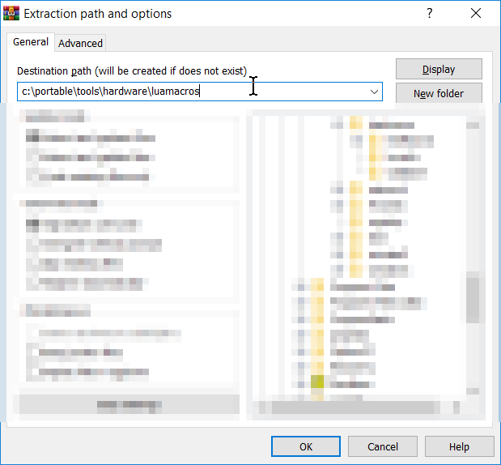

# luamacros
This software can recognize and manage multiple keyboards connected to computer with Windows OS. This is key feature to use it as macro triggerring application.
Other typical usage is for flight simulation when macro triggers can come from various sources like
* different keyboards
* game devices (joysticks)
* COM interface (arduino)
* small embeded http server
* game simulator itself - Xplane, on variable change

Macro action can be anything scripted in Lua language with some extensions
* serial communication
* Xplane simulator events (commands, data ref changes)
* http get
* OS commands

For details see http://www.hidmacros.eu/forum/

# Users guide

1. Extract the files to a folder on your drive

# binary download
Download [luamacros.zip](http://www.hidmacros.eu/luamacros.zip)

# developers guide
To compile & extend Luamacros yourself you need to
* Download & install Lazarus environment: http://www.lazarus-ide.org/. Be careful with environment versions. Author is using version 1.6 which is not the latest now (2017) but works without issues. You have to use 32bit version even if your windows OS is 64bit. This is because current DirectX headers (for DirectInput - game devices) requires 32bit structures to talk to Windows API. With 64b Lazarus you can have running application but game devices won't be detected. On the other hand when you need to modify XPL plugin you need 64b compiler. Luckily you can have dual installation of Lazarus IDE (that's my setup) or switch between compilers and target platforms. Contribution here is appreciated to upgrade Luamacros to the latest IDE and even make it 64b application. However before submitting pull request make sure your game devices are detected and also keyboard keys are blocked when hooked by script. Note you must compile also winhook dll when doing some structure changes.
* clone Luamacros code from this repository: https://github.com/me2d13/luamacros.git
* before opening luamacros project you need to install several packages into Lazarus IDE. They are located in lib subfolder. Maybe this could be somehow included into Lazarus project, but I'm not such expert - just found a way that works. Those packages are
  * Inetbase - for http communication 
  * uniqueinstance_package - to ensure only one luamacros instance is running
  * ExtraHighliters_RT - for Lua syntax highlight
  * LazSerialPort - for COM device communication
* Those packages have zip files in lib subdirectory. Just extract those zip files, open lpk file from extracted location and choose Use - Install.
* Now you should be able to open all 3 projects. These are
  * LuaMacros - the main application exe. Important: if you need to execute compiled exe don't forget to copy lua dlls from lib directory to the same place as exe file
  * XplPlugin - dll used as XPlane plugin. Note this is 64b project so you need to adapt FPC compiler accordingly
  * WinHook - dll to set global keyboard hook
* When starting from your build environment make sure you copy LUA dlls (see lib folder) into your output directory. These dlls must be in the same directory as LuaMacros.exe. Without them program even won't start at all or crashes with some segmentation error (in IDE)

Hope it helps, have fun, feel free to extend this guide
